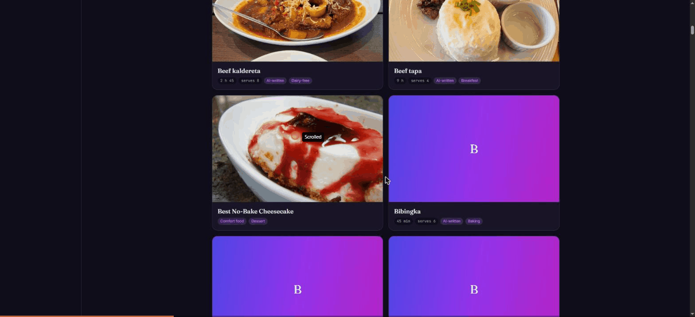

<h1 align="center">
  <picture>
    <source media="(prefers-color-scheme: dark)" srcset="./docs/docs/img/icon.png">
    
  </picture>
</h1>
<p align="center">
  <p align="center">A smart grocery list and recipe manager.</p>
</p>

<h4 align="center">
  <a href="https://kitchenowl.org">Website</a> |
  <a href="https://docs.kitchenowl.org">Docs</a> |
  <a href="https://docs.kitchenowl.org/latest/self-hosting/">Self-Hosting</a> |
  <a href="https://matrix.to/#/#kitchenowl:matrix.org">Matrix</a>
</h4>

<h4 align="center">
  <a href="https://github.com/TomBursch/kitchenowl">
    
  </a>
  <a href="https://hosted.weblate.org/engage/kitchenowl/">
    
  </a>
  <a href="LICENSE">
    
  </a>
</h4>

<h3 align="center">
 🍫 🥘 🍽
</h3>

KitchenOwl is a smart self-hosted grocery list and recipe manager. Add items to your
shopping list before you go shopping, keep recipes and get suggestions on what to
cook, plan meals, and track what the household spent.

- Add items to your shopping list and sync them in real time between people
- Manage recipes, scale them, and push their ingredients onto the list
- Plan meals so you always know what you are eating
- Track expenses and balances for the household
- Cooking mode: one screen, big touch targets, timers, screen kept awake

## 🧭 What this repository builds

This fork replaced the Flutter client with a React web client. What ships is:

| Directory | What it is |
| --- | --- |
| `backend/` | Flask + SQLAlchemy API, Python >= 3.14, dependencies via `uv` |
| `web/` | The client: React 19, Vite, Tailwind 4, TypeScript |
| `docs/` | MkDocs documentation source |
| `kitchenowl/`, `flutter/` | The old Flutter client and its pinned SDK submodule — **no longer built** |

The `Dockerfile` builds `web/` and serves it at the root alongside the API, in one
image. The Flutter builder that used to stand in front of it is gone: it cloned the
Flutter SDK and compiled the app on every build, which was most of the build time.

> [!NOTE]
> `kitchenowl/` and the `flutter/` submodule are still checked in, but nothing
> references them — not the Dockerfile, not CI, not the compose files. They are dead
> weight kept for reference and can be deleted whenever you are ready to stop
> hedging. `git log` has the old builder if it is ever wanted back.

## 📱 Screenshots

The web client: the recipe collection, then a recipe with its photograph, its
`AI-written` badge, scalable ingredients, and the method in stages.

<p align="center">
  
</p>

Two details worth pointing out, both visible above. Ingredients you already have are
ticked off against the pantry and say so (`In the kitchen as Pepper`), and a recipe
with no photograph gets a coloured card with its initial rather than a broken frame —
which is most of them, because only 27 of the 150 seeded recipes have a freely
licensed photograph.

<details>
<summary>Screenshots of the retired Flutter app</summary>

Kept for reference. These are **not** the current client.

<table>
  <tr>
    <td></td>
    <td></td>
    <td></td>
    <td></td>
   </tr>
</table>

</details>

## 🤖 Where AI is used, and where it is not

Two separate integrations, in different places, with different trust levels. Both are
**opt-in and off by default** — the app is fully usable with neither configured.

### In your browser, talking to OpenRouter

Configured under **Settings → AI**. The API key is kept in `localStorage` and sent
only to `openrouter.ai` — never to the KitchenOwl server, which has no field for it
and no reason to see it. The trade is the usual one for a `localStorage` secret: any
script on the origin could read it, which is acceptable for something you host for
yourself and would not be for a shared service.

| Feature | What it does |
| --- | --- |
| Paste-to-recipe | Turns pasted text — a message from a relative, a page you typed up — into a recipe draft |
| Photo-to-recipe | Reads a photograph of a cookbook page or a handwritten card |
| Tag suggestions | Labels a recipe from a **closed** vocabulary (see `web/src/lib/recipeTags.ts`) |
| Pantry translation | Translates Spiso pantry item names to English, batched and cached forever |

The default model is `google/gemini-2.5-flash-lite`, picked by measurement rather than
reputation: twelve vision models were given the same badly-lit photograph of a
Romanian page and scored against what it actually said. The property that mattered was
reading diacritics off a poor photograph — a model that writes "Papanăși" confidently
is worse than one that fails loudly. The model picker lists the live OpenRouter
catalogue with context length and price, so this is a default, not a lock.

**Nothing a model writes is allowed to pass as something a person cooked.** Every
model-produced recipe carries `source: ai://<model>` and an `AI-written` tag, and the
recipe page shows a badge for it. Drafts are never saved until you press the button — a
model is a decent typist and an unreliable cook.

Deliberately *not* model-generated: **ingredient substitutes**. Those are written by
the cook, because a guessed substitution is a wrong dinner.

### On the server, optional

| Variable | Effect |
| --- | --- |
| `LLM_MODEL`, `LLM_API_URL` | Enables LLM ingredient parsing in `backend/app/service/ingredient_parsing.py`. Unset means the deterministic parser is used. |
| `DEEPL_AUTH_KEY` | Enables DeepL translation |

### The seeded recipes

`web/public/seeds/` holds 150 recipes — the 50 most common Romanian, Filipino and
Danish home dishes — written by a model and kept in the repo so that what it wrote is
reviewable like code. All 150 are tagged `AI-written` and carry their model in
`source`. **None has been cooked by a person.** Quantities and times are plausible and
internally consistent; the first cook of any given one is still a test.

`web/src/lib/seeds.test.ts` holds every seed to the API's shape and the closed tag
vocabulary, so a malformed seed fails in CI rather than months later as a recipe with
no method. See [`web/README.md`](web/README.md) for how to load them.

## ⚙️ Configuration

All backend configuration is environment variables. Any of them can instead be read
from a file by setting `<NAME>_FILE`, which is how you pass Docker secrets.

**The two that matter**

| Variable | Default | Notes |
| --- | --- | --- |
| `JWT_SECRET_KEY` | `super-secret` in code, `PLEASE_CHANGE_ME` in the image | **Change it.** Every token signs against this, and changing it later signs everyone out. |
| `FRONT_URL` | unset | Origin allowed for CORS and Socket.IO. Accepts a comma-separated list. Live updates fail without it when the client is on another origin. |

**Storage and database**

| Variable | Default |
| --- | --- |
| `STORAGE_PATH` | project dir (`/data` in Docker) |
| `DB_DRIVER` | SQLite |
| `DB_HOST`, `DB_PORT`, `DB_NAME` | — |
| `DB_POOL_SIZE`, `DB_MAX_OVERFLOW`, `DB_SQLITE_SYNCHRONOUS` | — |
| `MESSAGE_BROKER` | unset; needed for multi-worker live updates |

**Accounts and sign-in**

`OPEN_REGISTRATION`, `DISABLE_ONBOARDING`, `DISABLE_USERNAME_PASSWORD_LOGIN`,
`EMAIL_MANDATORY`, `JWT_REFRESH_TOKEN_EXPIRES` (days, default 30), `OIDC_ISSUER`,
`OIDC_CLIENT_ID`, `OIDC_RFC_COMPLIANT_REDIRECT`, `GOOGLE_CLIENT_ID`,
`APPLE_CLIENT_ID`.

**Mail, metrics, extras**

`SMTP_HOST`, `SMTP_PORT`, `SMTP_FROM`, `SMTP_REPLY_TO`, `SMTP_USE_TLS`,
`COLLECT_METRICS`, `METRICS_USER`, `PRIVACY_POLICY_URL`, `TERMS_URL`,
`KITCHENOWL_MCP_ENABLED` (exposes an MCP endpoint at `/mcp`).

Access tokens last **15 minutes**; refresh tokens `JWT_REFRESH_TOKEN_EXPIRES` days.

## 🛠️ Development

### Backend

```sh
cd backend
uv sync
uv run python wsgi.py
```

Python >= 3.14. With nothing configured it uses SQLite under `STORAGE_PATH`.

`wsgi.py` rather than `flask run`: the app serves Socket.IO for live updates, and
`socketio.run` is what starts a server that can carry it. It listens on **:5000**. The
production image runs the same app under uwsgi instead.

### Web client

```sh
cd web
npm install
npm run dev
```

Vite serves on `:5173` and **proxies `/api` and `/socket.io`** to the backend, so the
client uses the same relative paths in development as in production.

| Variable | Default | Notes |
| --- | --- | --- |
| `KITCHENOWL_API` | `http://localhost:8088` | Proxy target for both `/api` and `/socket.io` |
| `VITE_BASE` | `/` | Base path at build time |

The default assumes the backend is the container (`docker-compose` maps it to
`:8088`). Running the backend directly instead puts it on `:5000`, so point the proxy
at it:

```sh
KITCHENOWL_API=http://localhost:5000 npm run dev
```

The API is proxied rather than called cross-origin deliberately: the backend only
sends CORS headers when the referrer matches `FRONT_URL`, so a direct call from the
dev server is rejected.

| Command | What it does |
| --- | --- |
| `npm test` | Vitest — 1310 tests |
| `npm run typecheck` | `tsc -b --noEmit` |
| `npm run lint` | Oxlint |
| `npm run build` | Typecheck then production build |
| `npm run seed:dry` / `npm run seed` | Load the seed recipes into a household |

### Docker

```sh
docker compose up -d
```

`docker-compose.yml` pulls published images. To build this tree instead:

```sh
docker build -t kitchenowl:local .
```

Variants for Postgres and RabbitMQ are in `docker-compose-postgres.yml` and
`docker-compose-rabbitmq.yml`.

## 🙌 Contributing

From opening a bug report to creating a pull request: every contribution is
appreciated and welcomed. If you're planning to implement a new feature or change the
API please create an issue first. This way, we can ensure your work is not in vain.
For more information see [Contributing](CONTRIBUTING.md) or get in contact by joining
our [Matrix space](https://matrix.to/#/#kitchenowl:matrix.org).

### 🌍 Translations

You can help translate the App into your language by using
[Weblate](https://hosted.weblate.org/engage/kitchenowl/)!

<p align="center">
  <a href="https://hosted.weblate.org/engage/kitchenowl/">
    
  </a>
</p>

## 📚 Related

- [Website](https://kitchenowl.org) · [Docs](https://docs.kitchenowl.org)
- [Upstream project](https://github.com/TomBursch/kitchenowl) this fork follows
- [KitchenOwl Python Client](https://github.com/TomBursch/kitchenowl-python) · [Home Assistant Integration](https://github.com/TomBursch/kitchenowl-ha)
- [Recipe scrapers](https://github.com/hhursev/recipe-scrapers) used for scraping recipes from the web
- [Wikimedia Commons](https://commons.wikimedia.org/) for the freely-licensed recipe photographs
- [Weblate](https://weblate.org/) is helping with continuous localization as part of their ongoing support for open-source software projects.

### 🔨 Built With

- [Flask](https://flask.palletsprojects.com/) and [SQLAlchemy](https://www.sqlalchemy.org/)
- [React](https://react.dev/), [Vite](https://vite.dev/) and [Tailwind CSS](https://tailwindcss.com/)
- [Docker](https://docs.docker.com/)
- [OpenRouter](https://openrouter.ai/) for the optional in-browser model features

## 🍀 Contributors

<a href="https://github.com/tombursch/KitchenOwl/graphs/contributors">
  
</a>

## 📜 License

KitchenOwl is Free Software: You can use, study share and improve it at your will.
Specifically you can redistribute and/or modify it under the terms of the AGPL-3.0
License.
